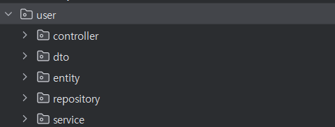

# mafra-be-python-orm

## 데이터베이스(Database)

데이터를 영구적으로 저장하고 효율적으로 관리하기 위한 시스템

### 데이터베이스의 분류

종류마다 저장 방식과 사용 목적이 다르다. 그렇기 때문에 상황에 맞추어 적절한 데이터베이스를 선택하는 것이 중요하다.

#### 관계형 데이터베이스(RDB,Relational Database)

- 테이블 형태로 데이터 저장(MySQL, PostgreSQL, Oracle)
- SQL(Structured Query Language) 사용
- 정형화된 구조의 데이터를 다룰 떄
- 복잡한 관계(Join)이 필요할 때
- 데이터 무결성(정확성)이 중요한 시스템

#### 비관계형 데이터베이스(NoSQL)
- 문서, 키-값, 그래프 등 다양한 형태로 데이터 저장(MongoDB,Redis)
- 유연한 스키마를 사용하기 때문에 수평적 확장에 유리
- 대규모 데이터를 빠르게 저장/조회 가능

## ORM(Object-Relational Mapping)

객체지향 언어의 객체를 관계형 데이터베이스의 테이블과 매핑시켜주는 도구
> SQL을 직접 작성하지 않고, 객체를 통해 데이터 베이스를 조작할 수 있게해주는 기술
> 개발자가 SQL작성에 신경쓰지 않고 비즈니스 로직 및 서비스 구현에 집중할 수 있게 해줌
> ORM을 사용하기에는 비관계형 데이터베이스는 적합하지 않다.
> 개발자가 데이터베이스에서 가져온 데이터에 대해서 무결성이나 조건 등을 확인해야하니까

### 언어별 ORM 프레임워크

- Java: JPA, Hibernate, MyBatis
- Python: SQLAlchemy, Django 
- JavaScript: TypeORM, Sequlize

## 영속성 계층(Persistence Layer)

API(애플리케이션)에서 데이터베이스와 직접 연결되어 데이터를 저장 조회하는 계층

> DB를 접근하기 위한 객체들만 관리하는 계층, 데이터의 저장, 조회만 책임
> 매번 DB에 접근하여 조회하여 데이터를 가져온다면 속도도 느리고 메모리도 지속적으로 사용하는 낭비 발생생
> 필요한 순간에 한 번에 DB에 반영할 때 필요한 모양틀같은 역할
> -> `캐시메모리+인터페이스` 같은 느낌

### 특징

- 불변성: 외부 요청에 따라 바뀌지 않음, 명시적으로 저장/조회 요청시에만 DB와 통신
- 책임분리: 
  - 서비스 계층은 비즈니스 로직 수행에 집중하고  
  - 영속성 계층은 데이터 저장 및 조회만 담당한다.

- Controller: 클라이언트 요청을 받아 적절한 서비스 로직을 호출한다.
- DTO: 계층 간 데이터 전달을 위한 객체. API 입력/출력용으로 사용된다.
- Entity: DB 테이블과 매핑되는 객체로, DB에 실제로 저장될 데이터를 담는다.
- Repository / DAO: DB에 접근해 데이터를 조회하거나 저장하는 역할
- Service: 비즈니스 로직을 수행하는 계층으로, 외부 요청의 목적에 따라 데이터를 가공하거나 검증한다.
